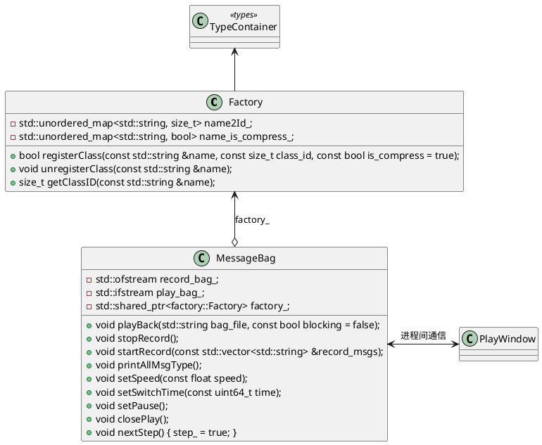

# 类图

代码中使用了一些模板元编程，故类图只显示了简单的关系

```puml
@startuml

class Factory{
    + bool registerClass(const std::string &name, const size_t class_id, const bool is_compress = true);
    + void unregisterClass(const std::string &name);
    + size_t getClassID(const std::string &name);
    - std::unordered_map<std::string, size_t> name2Id_;
    - std::unordered_map<std::string, bool> name_is_compress_;
}

class MessageBag
{
        + void playBack(std::string bag_file, const bool blocking = false);
        + void stopRecord();
        + void startRecord(const std::vector<std::string> &record_msgs);
        + void printAllMsgType();
        + void setSpeed(const float speed);
        + void setSwitchTime(const uint64_t time);
        + void setPause();
        + void closePlay();
        + void nextStep() { step_ = true; }

        - std::ofstream record_bag_;
        - std::ifstream play_bag_;
        - std::shared_ptr<factory::Factory> factory_;
}

class PlayWindow{

}

class TypeContainer<<types>>

TypeContainer <-- Factory
Factory <--o MessageBag:factory_
MessageBag <-> PlayWindow:进程间通信
@enduml

```